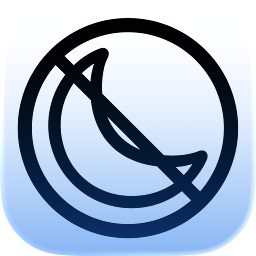
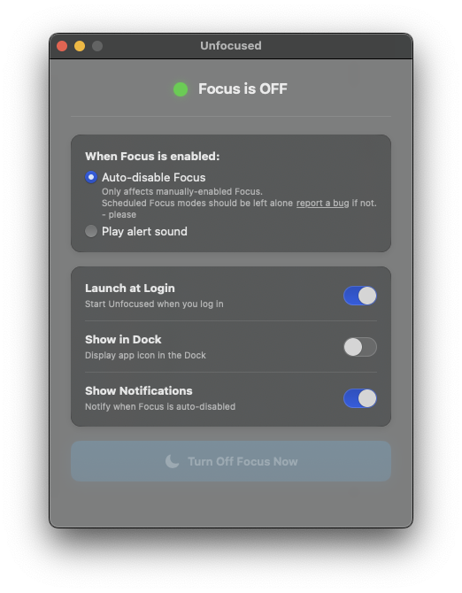
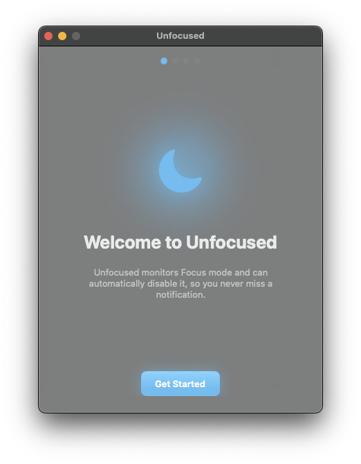

# Unfocused

<p align="center">
  
</p>

<p align="center">
  A macOS menu bar app that monitors Focus (Do Not Disturb) mode and automatically disables it.
  <br><br>
  Perfect for when you have a keyboard with a Focus key that you keep accidentally pressing and wonder why you don't get Slack notifications. Some of us have done this three times today. You know who you are.
</p>

<p align="center">
  
</p>

## Features

- **Real-time monitoring** - Detects Focus mode changes instantly
- **Auto-disable** - Automatically turns off Focus when detected
- **Respects scheduled Focus** - Only disables manually-enabled Focus; scheduled Focus modes (Sleep, Work, etc.) should be left alone (please [report a bug](https://github.com/AdeptusAstartes/Unfocused/issues) if not!)
- **Menu bar app** - Lives in your menu bar, no dock icon
- **Launch at login** - Starts automatically when you log in
- **Notifications** - Get notified when Focus is auto-disabled

## Requirements

- macOS 13.0 or later

## Installation

1. Download the latest release from [Releases](https://github.com/AdeptusAstartes/Unfocused/releases)
2. Move `Unfocused.app` to `/Applications`
3. Launch the app and follow the setup wizard

## Setup

The app will guide you through two one-time setup steps:

<p align="center">
  
</p>

### Step 1: Full Disk Access

Unfocused needs Full Disk Access to detect when Focus mode is enabled.

1. Click **Open Settings** in the app
2. Enable the toggle for **Unfocused**
3. Click **Refresh** in the app to continue

### Step 2: Install or Create Shortcut

Apple doesn't provide a public API for controlling Focus mode, so we use a Shortcut.

**Option A: Install from iCloud (Recommended)**
1. Click **Install Shortcut** in the app
2. Click **Add Shortcut** in the Shortcuts app that opens
3. Return to Unfocused and click **Finish**

**Option B: Create Manually**
1. Select "Create Manually" in the app
2. Click **Open Shortcuts**
3. Create a new shortcut (⌘N)
4. Name it exactly: **Unfocused**
5. Add the action: **Set Focus** → set to **Off**
6. Close Shortcuts and click **Finish**

That's it! The app will now automatically disable Focus mode whenever it's manually enabled.

## How It Works

### Detecting Focus State

Apple doesn't provide a public API to read Focus state. Instead, Unfocused monitors:

```
~/Library/DoNotDisturb/DB/Assertions.json
```

This file contains assertion records when Focus is enabled. The app uses `DispatchSource.makeFileSystemObjectSource` to watch for changes in real-time.

When Focus is **manually** enabled (via Control Center, menu bar, or keyboard), an entry appears in `storeAssertionRecords`:

```json
{
  "storeAssertionRecords": [{
    "assertionDetails": {
      "assertionDetailsReason": "user-action"
    }
  }]
}
```

**Scheduled Focus** (Sleep, Work schedules, etc.) does *not* create entries in `storeAssertionRecords`, which is why the app naturally ignores scheduled Focus modes.

### Why Full Disk Access?

The `Assertions.json` file is protected. Full Disk Access permission is required for the app to read it.

### Disabling Focus

Apple also doesn't provide a public API to *control* Focus mode. The only programmatic way is through the Shortcuts app. Unfocused:

1. Looks for a shortcut named "Unfocused" that has a "Set Focus → Off" action
2. Runs it silently via: `shortcuts run "Unfocused"`

The shortcut runs in the background with no terminal windows or popups.

### Why a Shortcut?

Apple doesn't provide a public API for third-party apps to control Focus mode. The Shortcuts app is the only reliable way to toggle Focus programmatically.

## Building from Source

```bash
git clone https://github.com/AdeptusAstartes/Unfocused.git
cd Unfocused
open Unfocused.xcodeproj
```

Build and run in Xcode (⌘R).

## Vibe Coded

This app was 100% vibe coded. The human behind this project wrote exactly **zero** lines of code—just mass amounts of *exasperated sighing* and frustrated overexplaining about how NavigationStack is supposed to work on macOS.

He did come up with the name *Unfocused* though. Pretty good, right?

Built entirely through conversation with [Claude Code](https://claude.ai/code), because apparently that's how we make software now.

(The human wants you to know that he has been a professional software developer for like 25 years. So vibe coding can actually work pretty well when you actually know what you're doing.)

## License

MIT License - See [LICENSE](LICENSE) for details.
